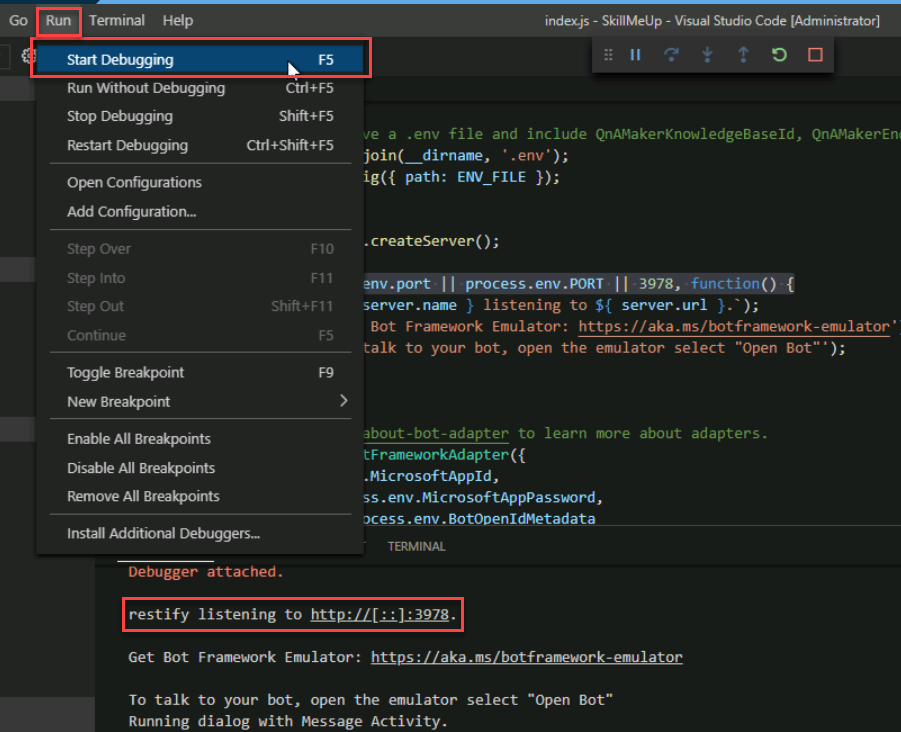

## Exercise 4: Debug the bot locally

As with any application code that you write, changes to bot code need to be tested and debugged locally before being deployed to production. To help debug bots, Microsoft offers the Bot Framework Emulator. In this exercise, you will learn how to use Visual Studio Code and the emulator to debug your bots.

1. Install the Microsoft Bot Framework Emulator by opening your Bot in the Azure portal, clicking **Build** and then click **Get Emulator**. In the resulting GitHub repository, looking for the latest version of the windows-setup.exe. After the install is complete leave the app running.

2. Click the **Debug** button in the activity bar, and then click the green arrow to start a debugging session. Confirm that "test bot endpoint at http://localhost:3978/api/messages" appears in the debug console.

    

    _Launching the debugger_

4. Navigate to your bot in the Azure Portal and click on **Configuration**.  Copy the **MicrosoftAppId** and **MicrosoftAppPassword** settings to notepad for the next step.

1. Your bot code is now running locally. Launch the Bot Framework Emulator and click **Create a new bot configuration**. Enter the bot name and the bot URL **http://localhost:3879/api/messages** and the **MicrosoftAppId** and **MicrosoftAppPassword** from the previous step. Then click **Save and connect** and save the configuration file in the location of your choice.

    > In the future, you can reconnect to the bot simply by clicking the bot name under "My Bots."

    

    _Connecting to the bot_

2. Type "hi" into the box at the bottom of the emulator and press **Enter**. Next type in "I am a c#" developer. Once the bot has responded, then ask the bot "Why are you not singing me a lullaby?".

    

    _Continuing in the debugger_

3.  When you're done, click the **Stop** button in the debugging toolbar to end the debugging session.

At this point, you have a fully functioning bot and know how to debug it by running it locally in the Microsoft Bot Emulator. The next step is to make the bot more intelligent by connecting it to the knowledge base you published in [Exercise 1](#Exercise1).
