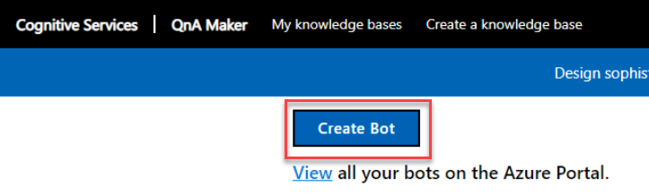
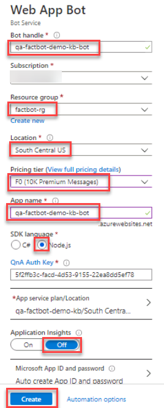
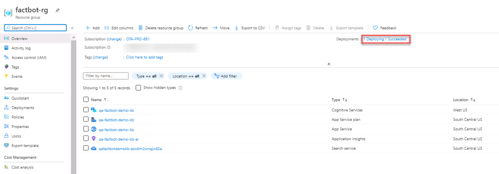

## Exercise 2: Create an Azure Web App Bot

The next step in creating a bot is to provide a location for the bot to be hosted in Azure. Azure Web Apps are perfect for hosting bot applications, and the Azure Bot Service is designed to provision them for you. In this exercise, you will use the Azure portal to provision an Azure Web App Bot from QnA Maker.

1. From within the QnA Maker Portal Publish page click **Create Bot**.
    
    

2. In the blade that opens, enter the following configuration then click **Create**.

    - Bot handle: **Enter a unique name or accept the default value**. 

    - Resource group: **factbot-rg**

    - Location: **The region closest to you**

    - Pricing tier: **F0**

    - SDK language: **Node.js**

    - Application insights: **Off**

    . 

3. Click **Resource groups** in the portal's left navigation. Then click **factbot-rg** to open the resource group created for the Azure Web App Bot. Wait until "Deploying" changes to "Succeeded" at the top of the blade indicating that the Azure Web App Bot was successfully deployed. Deployment generally requires two minutes or less. Periodically click **Refresh** at the top of the blade to refresh the deployment status, as it will not update automatically.

    

4. Click on the Web App Bot in the Azure portal and click **Test in Web Chat** under **Bot management** on the left to open the test console. Enter **What's the most popular software programming language in the world?** into the box at the bottom of the chat window and press **Enter**. Confirm that the bot responds as shown in the below screenshot. 

    

Behind the scenes, a lot happened when the Azure Web App Bot was deployed. A bot was created and registered, an Azure Web App was created to host it, and the bot was configured to work with Microsoft QnA Maker. The next step is to get the code and run it locally.  

## Progressing to the next exercise  
  
After you have completed the exercise, click **Next** to move to the next exercise.  