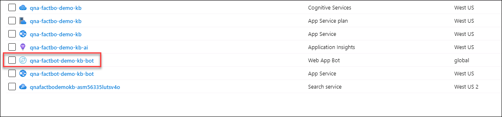
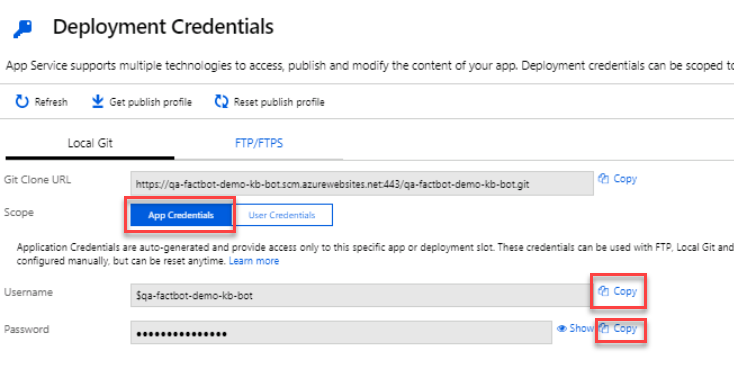
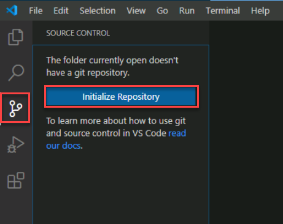

## Exercise 3: Deploy a bot with Visual Studio Code

When you created an Azure Web App Bot in Exercise 2, an Azure Web App was deployed to host it. But the bot does require some code, and it still needs to be deployed to the Azure Web app. Fortunately, the code was generated for you by the Azure Bot Service. In this exercise, you will use Visual Studio Code to place the code in a local Git repository and publish the bot to Azure by pushing changes from the local repository to a remote repository connected to the Azure Web App that hosts the bot — a process known as continuous integration.

1. Go to and install the latest LTS version of Node.js

    ```html
    https://nodejs.org/
    ```

2. Create a folder named "Factbot" in the location of your choice on your hard disk to hold the bot's source code.

3. Return to the Azure Portal and open the **factbot-rg** resource group. Then click the Web App Bot you created in Exercise 1.

    

4. Click **Build** under **Bot management** on the left and click **Download bot source code** to prepare a zip file containing the bot's source code. Click **Yes** then **Download bot source code** again when prompted. Once the zip file is downloaded, open it and extract the contents of the zip file to **C:\\SkillMeUp**.

    

5. Still on the **Build** blade, click **Publish Updates Automatically to Azure with Continuous Deployment** on the right. Then select **Local Git** as the deployment source and click **Continue**. From there select **App Service Build Service** and click **Continue** and then **Finish**.

6. Copy the **Git Clone Url** value and paste it into notepad.

7. Click **Deployment Credentials** at the top then select **App Credentials** in the dialog that appears. Copy the user name and password to notepad. These will be used for connecting to the Git repository for your bot.

    

8. Launch **git bash** from the Start menu and execute the following commands to partially configure Git to use the credentials copied. Replace **[Git user name]** with the username you copied in the previous step. 

    ```bash
    git config --global user.email [Git user name]
    ```

    ```
    git config --global user.name [Git user name]
    ```

9. Start **Visual Studio Code** from the Start menu and click **File** > **Open Folder...** in the top left. Browse to **C:\\SkillMeUp** and click **Select folder**. 

10. Click the **Source Control** button in the activity bar on the left side of Visual Studio Code then click **Initialize repository**. 

        

11. Enter **First commit.** into the message box, and then click the check mark to commit your changes. Click **Yes** when prompted.

    

12. Click **View** > **Terminal** at the top of the Visual Studio Code window to open an integrated terminal. Then execute the following command in the integrated terminal, replacing [GIT-USER-NAME] and [GET-CLONE-URL] with the values copied to notepad earlier. Don't include **https** in the git clone url.

    ```bash
    git remote add qna-factbot https://[GIT-USER-NAME]@[GIT-CLONE-URL]
    ```

13. Click the ellipsis (the three dots) at the top of the SOURCE CONTROL panel and select **Publish Branch** from the menu to push the bot code from the local repository to Azure. If prompted for credentials, enter the user name and password you copied earlier in this exercise. 

      

    Once the branch is published, you can validate by checking to see if your local branch is up to date by running the command:  

    ```  
    git status
    ```  

    When up to date, you'll get a message such as `Your branch is up to date with 'qna-factbot/master'`.  

Your bot has been published to Azure. But before you test it there, let's run it locally and learn how to debug it in Visual Studio Code.  

## Progressing to the next exercise  
  
After you have completed the exercise, click **Next** to move to the next exercise.  
