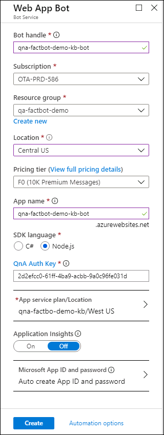

## Exercise 2: Create an Azure Web App Bot

The next step in creating a bot is to provide a location for the bot to be hosted in Azure. Azure Web Apps are perfect for hosting bot applications, and the Azure Bot Service is designed to provision them for you. In this exercise, you will use the Azure portal to provision an Azure Web App Bot from QnA Maker.

### Begin Exercise

1. From within the QnA Maker Portal Publish page click on **Create Bot**.
    
    

2. Enter a name such as **qa-factbot** into the **Bot name** box. *This name must be unique within Azure, so make sure a green check mark appears next to it.* Select **Create new** under **Resource group** and enter the resource-group name **factbot-rg**. Then select the free **F0** pricing tier. Select Node under **SDK Language**.  Click **App service plan/Location** followed by **Create New** and create an app service plan named **qa-factbot-demo-kb** or something similar in the same region that you selected earlier. Once that's done, click **Create** at the bottom of the blade to start the deployment.

    . 

3. Click **Resource groups** in the ribbon on the left side of the portal. Then click **factbot-rg** to open the resource group created for the Azure Web App Bot. Wait until "Deploying" changes to "Succeeded" at the top of the blade indicating that the Azure Web App Bot was successfully deployed. Deployment generally requires two minutes or less. Periodically click **Refresh** at the top of the blade to refresh the deployment status, as it will not update automatically.

    

4. Click on the Web App Bot in the Azure portal and click **Test in Web Chat** on the left to open the test console. Type "What's the most popular software programming language in the world?" into the box at the bottom of the chat window and press **Enter**. Confirm that the bot responds as follows:

    

    _Testing the bot_

Behind the scenes, a lot happened when the Azure Web App Bot was deployed. A bot was created and registered, an Azure Web App was created to host it, and the bot was configured to work with Microsoft QnA Maker. The next step is to get the code and run it locally.